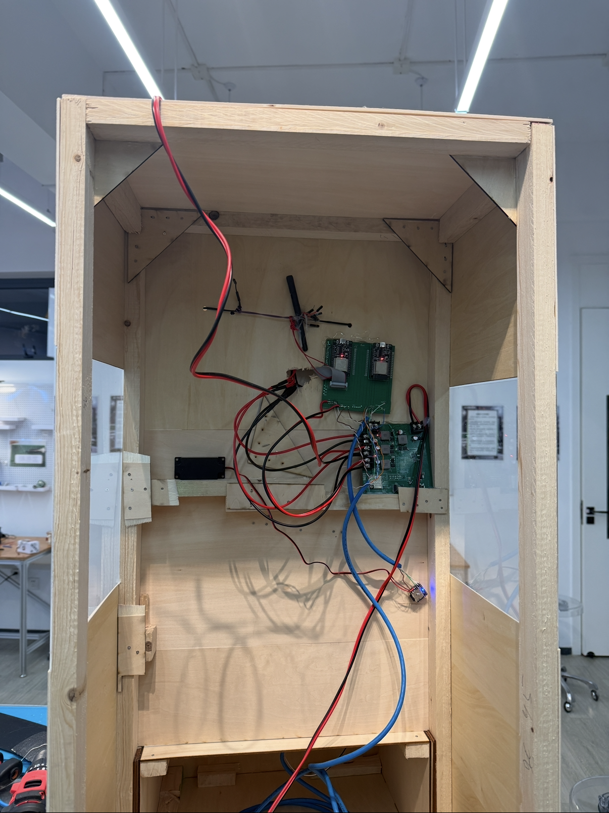
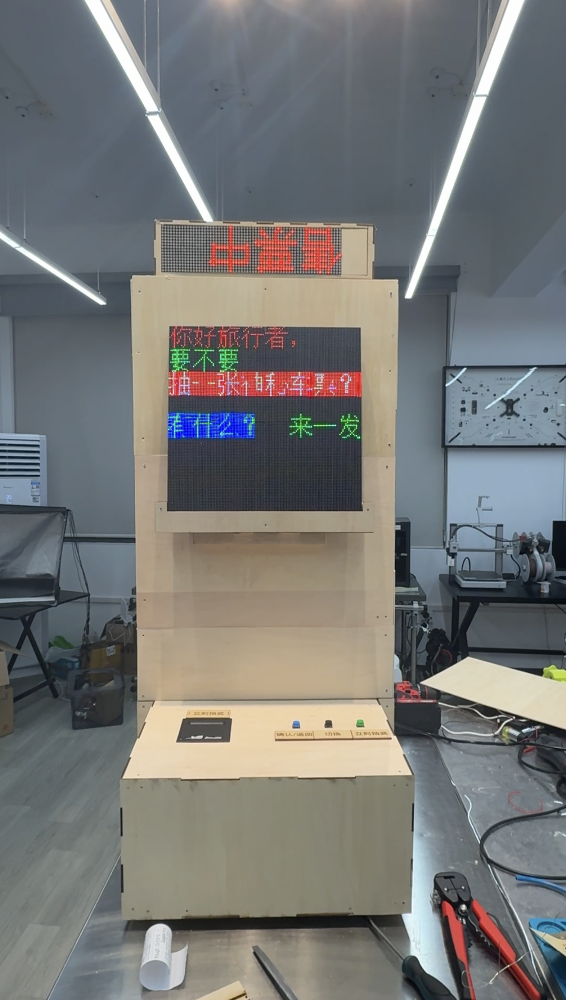

https://github.com/user-attachments/assets/78aff1f7-db0b-49fb-8cf2-9953bcf3156d
# Ticket Selling Machine

A **Ticket Selling Machine** system that simulates a ticket vending experience using a thermal printer, an LED matrix display, audio playback (DFPlayer Mini), and physical buttons. The system is split into two logic units that communicate via GPIO.

  <table>
    <tr>
      <td align="center" width="33%">
        
         
        搭建中 In construction
      </td>
      <td align="center" width="33%">
        
         
        成品 Finished product
      </td>
      <td align="center" width="33%">

https://github.com/user-attachments/assets/e4759234-d74b-473b-baff-2b0c59afa24b

📹 演示视频 Demo video
      </td>
    </tr>
  </table>

## Overview

The project consists of two independent subsystems:

1. **Main Control Unit (`main_control/`)**
   - **Platform:** MicroPython (ESP32).
   - **Responsibilities:**
     - Handling user input from physical buttons.
     - Controlling the **Thermal Printer** via UART (TTL).
     - Controlling audio playback via **DFPlayer Mini**.
     - Sending control signals to the LED Screen unit.
   - **Key File:** `main_control/New_Main.py`

2. **LED Screen Display Unit (`ledscreen/`)**
   - **Platform:** Arduino C++ (ESP32).
   - **Hardware:** HUB75 RGB LED Matrix.
   - **Responsibilities:**
     - Rendering the user interface (UI).
     - Displaying station lists, ticket information, and animations.
     - Communicating state changes back to the Main Control unit.
   - **Key File:** `ledscreen/New_LED.ino`

## Hardware Interfaces & Pinout

### 1. Inter-Unit Communication (Handshake)

The two units communicate using a simple 4-wire GPIO protocol.

| Main Control (Pin) | Direction | LED Screen (Pin) | Function |
| :--- | :---: | :--- | :--- |
| `12` (LED_TO_PIN_1) | `->` | `35` (LED_IN_PIN_2) | Signal "Next" / Change selection |
| `13` (LED_TO_PIN_2) | `->` | `34` (LED_IN_PIN_1) | Signal "Confirm" / Select |
| `21` (LED_FROM_PIN_1) | `<-` | `21` (LED_OUT_PIN_1) | Feedback: Selection changed (Pass) |
| `22` (LED_FROM_PIN_2) | `<-` | `22` (LED_OUT_PIN_2) | Feedback: Selection confirmed |

> Note: Pin assignments are based on `New_Main.py` and `New_LED.ino`. Always verify physical wiring.

### 2. Main Control Peripherals

- **Thermal Printer:**
  - TX: Pin 16
  - RX: Pin 17
  - Baud Rate: 115200
- **DFPlayer Mini:**
  - TX: Pin 26
  - RX: Pin 27
- **Buttons:**
  - Button 1 (Next): Pin 4 (Pull-down)
  - Button 2 (Confirm): Pin 5 (Pull-down)

### 3. LED Screen Peripherals (HUB75)

- Standard HUB75 pinout (R1, G1, B1, R2, G2, B2, A, B, C, D, E, CLK, LAT, OE) defined in `New_LED.ino`.

## Directory Structure

- `main_control/`: MicroPython source code.
  - `New_Main.py`: Entry point for the main controller. Contains the state machine for button presses, printer commands (`print_text`), and audio triggers.
  - `dfplayermini.py`: Driver library for the MP3 module.
  - `.mpyproject.json`: Configuration for Pymakr/MicroPython tools.

- `ledscreen/`: Arduino/C++ source code.
  - `New_LED.ino`: Main Arduino sketch. Handles the display state machine (`INIT`, `CHECK`, `PICK`), drawing logic (`draw_ticket_interface`), and randomization.
  - `Data.h`: Bitmap data for fonts and images (e.g., `station_list_matrixData`).
  - `ESP32-HUB75-VirtualMatrixPanel_T.hpp`: Driver/wrapper for the LED matrix.

## Development & Usage

### Main Control (MicroPython)

1. Environment: VS Code with Pymakr extension or similar MicroPython tools.
2. Upload `New_Main.py` and `dfplayermini.py` to the board.
3. `New_Main.py` runs in a `while True` loop and will run automatically on boot if renamed to `main.py` or called from it.

### LED Screen (Arduino)

1. Environment: Arduino IDE or PlatformIO.
2. Dependencies:
   - `ESP32-HUB75-MatrixPanel-I2S-DMA` library.
   - `Adafruit GFX` (required by the matrix library).
3. Compile and upload `New_LED.ino` to the ESP32 driving the matrix.

## Notes

- **Printer Commands:** `New_Main.py` contains a comprehensive set of byte sequences for controlling the thermal printer (formatting, Chinese characters, barcodes). Do not modify the byte constants unless you know the specific ESC/POS commands.
- **Randomization:** The "Pick" feature (ticket lottery) uses a random seed to simulate a spinning roulette before settling on a station.

## License

MIT License. See `LICENSE`.
